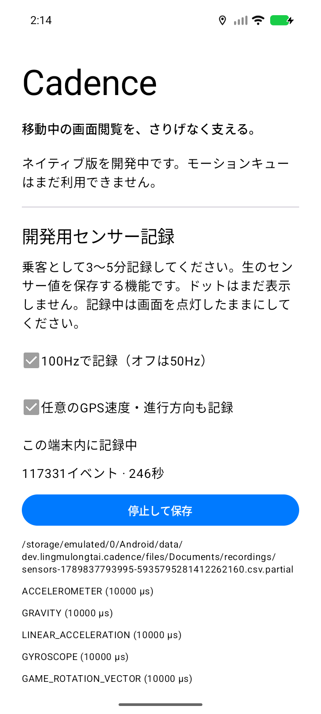

# フェーズ1: 計測機能の検証

2026-09-20。**ソフトウェアの検証記録であり、フェーズ1の実走行受け入れ完了ではない。**
市街地走行・停車中の手振り等の実機CSVは未収集。
指令書の順序に従い、モーションエンジン・オーバーレイのフェーズへは進んでいない。

## ビルド・JVM

JDK 17.0.19、Gradle 9.4.1、AGP 9.2.1、Kotlin 2.3.21、Platform 37.0。
WindowsのASCII junction `C:\cadence-native-build` から実行。

```powershell
.\gradlew.bat :motion:test :app:lintDebug :app:lintRelease :app:assembleDebug :app:assembleRelease
```

- JUnit5: **11テスト、失敗0、エラー0**。
  配列の所有権、全センサー型のCSV往復、GPSの任意値、locale非依存、BOM/CRLF、
  不正行、安定ソート、空入力、`.partial` の拒否、元データの上書き防止を検証。
- debug / releaseビルド成功。release APKは署名前の検証用であり、配布リリースではない。
- lint: debug 0 errors / 14 warnings、release 0 errors / 13 warnings。
  残る警告は固定済み依存関係の更新候補と、debug英語カウンターの複数形候補。
- `:motion:dependencies --configuration runtimeClasspath`: Kotlin stdlibとannotationsのみ。
  Android SDK、AndroidX、Google Play servicesに依存しない。
- Actions YAMLのパースと境界検査用Bashの構文検査は成功。
  GitHubへpushしていないため、ホストされたActionsジョブ自体は未実行。

## エミュレーターで確認した操作

専用AVD `Cadence_API_36`、API 36.1、`sdk_gphone64_x86_64` / `ranchu`、720×1600。
実機Galaxy S25 Ultraや最小対応API 26での実行とは区別する。

- 通知を拒否すると記録を開始しない。位置情報を拒否してもGPSなしの記録は可能。
- 50Hzで開始・画面から停止・ADB取り出しを確認。
- GPSを選択して端末のLocationを無効にした場合、`provider_disabled` と表示してセンサーを記録。
- 100Hzの明示選択で、5種類のセンサーの要求周期が10,000µsになる。
- ホーム画面への移動、アプリ再表示、英語から日本語への変更、画面回転後も
  センサー接続が1つであることを `dumpsys sensorservice` で確認。
- 通知を展開し「停止 / Stop」で正常終了。サービス消滅とセンサー接続0を確認。
- エミュレーターへ人工GPSを投入し、速度・bearingのCSV行が出ることを確認。
  緯度・経度のCSV列は存在しない。
- バックアップ規則を含む最終APKを再インストールし、起動と50Hz記録の開始・停止を再確認。



## 保存データとリプレイ

以下は**すべてエミュレーターデータ**。`testdata/reference/` に入れず、未追跡の
`.codex/emulator-recordings-final/` に保存した。
記録時間はCSVの最初と最後の単調増加timestampの差であり、GPS時刻や画面の時計ではない。

| 要求レート・条件 | 時間 | CSVイベント数 | 確認 |
| --- | ---: | ---: | --- |
| 50Hz、GPSオフ | 38.820秒 | 9,701 | 正常停止、JSONの件数と一致 |
| 50Hz、GPS選択・端末Locationオフ | 231.629秒 | 57,907 | 正常停止、件数一致、JVMリプレイ成功 |
| 100Hz、人工GPSあり、バッファ修正後 | 295.840秒 | 142,232 | 通知停止、件数一致、JVMリプレイ成功 |

100Hzの種別内訳: 加速度28,439、重力28,438、線形加速度28,433、ジャイロ28,410、
GAME_ROTATION_VECTOR 28,427、LOCATION 85。
要求レートは到着頻度の保証ではない。OSによる遅延・欠測を補間していない。

100Hzの入力CSVをJVMで安定ソートして出力し、別の検査スクリプトで全行・全値を比較した。
元データをtimestamp順に安定ソートした結果と**完全一致**。
元CSVのSHA256は `f76849a1b6764ddca4816eb29f043725633a11619a4e88f75525c58c759ab97c`。

初期の1,024件バッファでは、ビルドを並行実行したエミュレーターの100Hz記録中に
キューあふれを確認した。画面は失敗を表示し、`.csv.partial` と `complete: false` を保持した。
一時的なI/O・GC遅延の余裕を増やすため8,192件へ拡大し、上記の約5分記録を再確認した。
あふれを隠して値を捨てる処理は入れていない。

## APKの境界

検証したdebug APKのSHA256:
`59d2c42ec37fc55a1eef4e55010cd9dc2895e733f8b103bdefebb378a497f67d`。

- 両variantのパッケージ権限に `INTERNET` / `HIGH_SAMPLING_RATE_SENSORS` がない。
- releaseのManifestに記録サービスがなく、R8前のreleaseクラス群にも
  `SensorRecordingService` / `RecordingController` / `AndroidSensorSource` / `RecordingEntryPoint` がない。
- release APKのDEXを検査し、記録・CSVリプレイのクラス名が残っていないことを確認。
  R8による名前変更だけに頼らないよう、上記のR8前検査をCIにも追加した。
- releaseに記録用の位置情報・通知・foreground service権限がない。
- Manifestの `allowBackup=false` / `fullBackupContent=false` と、Android 12以降用の
  `dataExtractionRules` を確認。クラウドバックアップ・端末間転送の全アプリ領域を除外した。
  `allowBackup` だけでは一部端末の転送設定をカバーしないため、
  [Android公式のバックアップ仕様](https://developer.android.com/about/versions/12/behavior-changes-12#backup-restore)に従い明示した。

## 残る検証

実機での3〜5分の各シナリオ、センサーが不足する端末、API 26実行、GPS実測品質、
OSによる長時間停止、ディスク満杯・書込み中の電源断、Samsungの電池管理は未検証。
モーションエンジン、confidence、オーバーレイ、CPU・電池・遅延、健康上の効果も未検証。
次の作業は [実機ログの収集](../recording.md)。

## ローカルのコミット列

旧Expoは `legacy/expo` の `72c7cf6` に保存。
フェーズ0はローカル `main` にmerge commitを残して統合し、`phase-0-native-foundation` を付けた。
計測機能は `feat/sensor-recording` に置き、実機受け入れ前なのでフェーズ1完了タグは付けていない。
remoteの `main`、GitHub Releasesは変更していない。

| SHA | 件名 | 目的 |
| --- | --- | --- |
| `7c6e679` | chore(build): exclude native build and signing artifacts | 出力・鍵を除外し、承認済みGPL-3.0-onlyを追加 |
| `0815b95` | docs: define native migration scope and acceptance gates | 日英READMEと完了条件を明文化 |
| `02d38e9` | build: establish five native Kotlin modules | Gradle・Version Catalog・5モジュールを用意 |
| `459aeb0` | feat(ui): launch the native Compose application shell | ネイティブ起動画面を実装 |
| `94d2629` | ci(build): verify native variants and packaged permissions | ビルド・テスト・権限検査をCI化 |
| `cb38974` | docs: preserve Expo screens and UX decisions | 旧画面とUX意図を削除前に保存 |
| `f90d3d5` | refactor: retire the archived Expo implementation | 保存済みExpoの追跡ファイルを終了 |
| `1ceb9ad` | docs: record native foundation verification | 基盤の検証結果とスクリーンショットを記録 |
| `5053675` | chore(build): complete native foundation phase | 履歴を潰さずフェーズ0をローカルmainへ統合 |
| `b9c0a37` | build(sensor): provide injection and coroutine dependencies | Hilt・Flowによるサービス所有の準備 |
| `1df67b4` | feat(motion): replay lossless sensor recordings on the JVM | Android非依存の形式・リプレイ・テストを実装 |
| `f69f131` | feat(sensor): capture nonmagnetic sensor streams for diagnostics | 非地磁気センサーと任意GPSの購読・解放 |
| `d84d843` | fix(replay): reject unfinished sensor recordings | 中断ファイルと元データ上書きを拒否 |
| `4aeee9e` | feat(recording): save debug sensor sessions in a foreground service | サービスで記録を所有し、安全に完成ファイルを公開 |
| `d67b29b` | fix(recording): tolerate transient storage stalls at 100 Hz | 有限バッファで一時遅延を吸収 |
| `021be40` | feat(debug): expose sensor recording controls and status | 明示的な開始・停止・権限・設定操作を追加 |
| `2ee21a4` | fix(data): exclude app storage from backup and device transfer | センサーログの自動転送を除外 |
| `1567e3e` | ci(build): enforce the debug recording boundary | debugコードのrelease混入を検出 |

収集手順とこの検証記録のコミットは、この表に続く履歴を参照。
