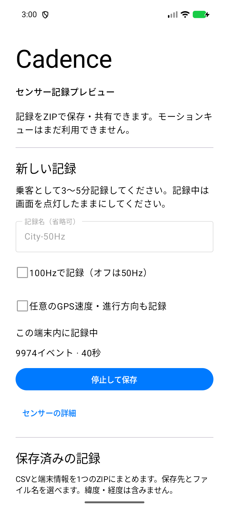
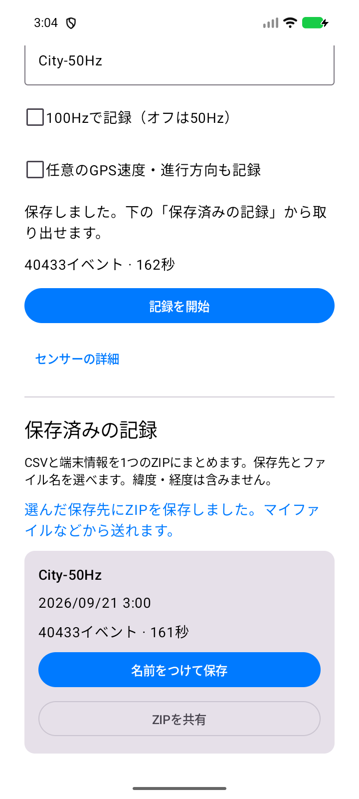
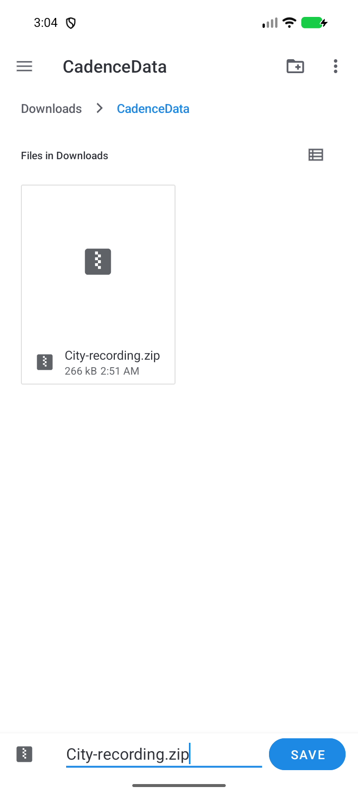
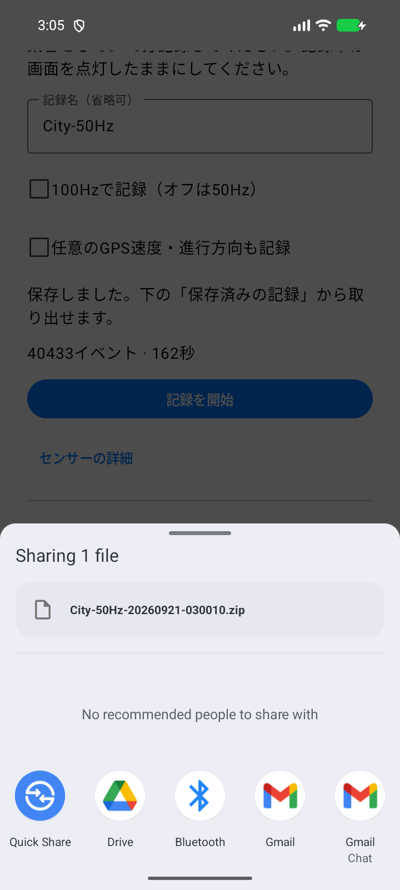

# 記録用プレビュー v0.1.0-alpha.1 の検証

確認日: 2026-09-21。対象は記録・保存・共有の導線。**Samsung実機や実走行の受け入れではない。**
コードと配布設定の確認点は `9d736a5`。画面は専用鍵で署名したversionCode 2 / versionName 0.1.0-alpha.1から撮影。

## 自動チェック

- `:motion:test`: 11件成功。CSV形式・値・再生順序・未完成ファイル拒否。
- `:data:testDebugUnitTest`: 7件成功。再読込、完成品のみの一覧、ZIP内の元バイト保持、
  件数不一致・壊れたCSV・未完成・パス逸脱の拒否、保存失敗時の元データ保持、旧JSON互換、ファイル名処理。
- `:app:lintDebug :app:lintRelease :app:assembleDebug :app:assembleRelease`: 成功。
  lintはdebug 0 errors / 15 warnings、release 0 errors / 14 warnings（依存版・既存の英語複数形等）。
- APKのapplication ID `dev.lingmulongtai.cadence`、minSdk 26 / targetSdk 37、versionCode 2を確認。
- debug APKの署名検証成功（APK Signature Scheme v2）。証明書SHA-256:
  `263bca65870c6b8959019f41f704d230dfc4d9fa766ed4a72e08549c40ca12f3`。
- 両APKにINTERNET、ACCESS_NETWORK_STATE、HIGH_SAMPLING_RATE_SENSORS、広いストレージ権限がない。
- debugに記録サービスとZIP専用Providerがある。releaseのmanifestと縮小前classに、
  記録サービス・センサー収集・保存一覧・ZIPエクスポート処理がない。
- GitHub Actions YAML、各runブロック、APK検査スクリプトの構文確認成功。
  タグのmain包含・版番号照合・署名・公開条件を読み取りレビューした。

ローカルではJDK 17とASCII junction `C:\cadence-native-build` を使用した。
OneDrive内の既存生成ディレクトリをGradleが更新できなかったため、未追跡init scriptで
`C:\Users\lingm\.codex\builds\cadence-recorder\<module>` へ生成先を切り替えた。
ソースや履歴は移動・削除していない。CIは通常の `<module>/build` で実行する。

## Android上の操作

Android 16 / API 36.1 の専用エミュレーター、720×1600、アプリは日本語。
システムの保存・共有画面はエミュレーターの英語表記。

1. 名前付きの50Hz記録を開始し、停止して完成することを確認。
2. アプリ更新・再起動後も、名前・日付・件数を持つ完成記録を再表示。
3. 「名前をつけて保存」でDocumentsUIを開き、キャンセル後も元記録と再試行ボタンが残ることを確認。
4. Downloads内に `CadenceData` フォルダを作り、ZIP名を `City-recording.zip` に変更。
5. 保存画面中にCadenceを `am kill` し、プロセス不在を確認してから保存を確定。
   再生成後、選んだ記録を正常に保存し、完了メッセージを表示した。
6. そのZIPを端末のDownloadから取得。26,475イベント / 105秒、CSV・JSONの2エントリー。
   CRC、JSONの完成状態・件数・名前を照合し、元ファイルとのバイト単位の完全一致を確認。
7. 「ZIPを共有」で1ファイルと正しいZIP名が表示され、Quick Share・Drive・Bluetooth等を選べることを確認。
   実際の外部送信はしていない。
8. 専用署名APKをクリーンインストールして通知を許可し、40,433イベント / 161秒の記録を保存。
   同じ保存名を選ぶと `City-recording (1).zip` になり、先のZIPを上書きしなかった。
   こちらもCSV・JSONの完成状態・件数と元のバイト列の一致を確認し、下記の4画面を撮影。

書込中にプロセスが破棄された場合はSavedStateHandleに処理段階を残し、復元時に中断を表示する。
遅い外部保存プロバイダーへの書込途中の強制終了は操作による再現を行っていない。
その場合、出力先には途中のZIPが残る可能性があるが、元CSV・JSONは変更しない。

## 画面

| 記録中 | 保存済みの一覧 |
| --- | --- |
|  |  |

| 名前とフォルダを選ぶ | ZIPを共有 |
| --- | --- |
|  |  |

## コミットと残る条件

| commit | subject | 目的 |
| --- | --- | --- |
| `9aef455` | `feat(data): preserve completed recordings in validated ZIP exports` | 完成した記録の一覧と、原本を保持したZIP化・形式検証 |
| `0d8a30c` | `feat(recorder): save and share named sessions from the phone` | スマホ内の記録名・保存先選択・共有・再生成対応 |
| `9d736a5` | `ci(release): publish signed recorder prereleases from main` | 専用署名・版番号・mainのタグからのプリリリース公開 |

続く文書コミットで、収集手順・公開手順・本検証記録と画面を追加する。
ネイティブ移行からの履歴は[フェーズ0](phase-0.md)と[フェーズ1](phase-1.md)も参照。
GitHub上の公開runと公開APKは、タグ公開後に確認する。

市街地走行・停車中の手振り・歩行等の実ログは未受領。エミュレーターの値を
`testdata/reference` へ入れず、フェーズ1完了タグも作成しない。
One UIの常駐、Samsungファイル管理・共有先での実動作、実際のセンサー品質・電池消費は引き続き実測が必要。
